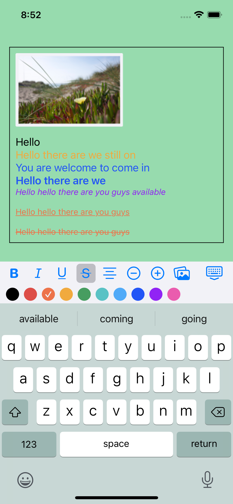

# TextEditor
&nbsp;&nbsp;&nbsp;&nbsp;&nbsp;&nbsp;


## Preview

```swift
import TextEditor

struct ContentView: View {
    let richText = NSMutableAttributedString()
    
    var body: some View {
        ZStack {
            Color(hex: "97DBAE")
                .edgesIgnoringSafeArea(.all)
            RichTextEditor(richText: richText) { _ in
                // try to save edited rich text here
            }
            .padding(10)
            .background(
                Rectangle()
                    .stroke(lineWidth: 1)
            )
            .padding()
        }
    }
}
```




## Usage

Add the following lines to your `Package.swift` or use Xcode "Add Package Dependency" menu.

```swift
.package(name: "TextEditor", url: "https://github.com/nothingsh/TextEditor", ...)
```

## Todo

- [ ] Add font selection
- [ ] Make Input Accessory View Configurable 
